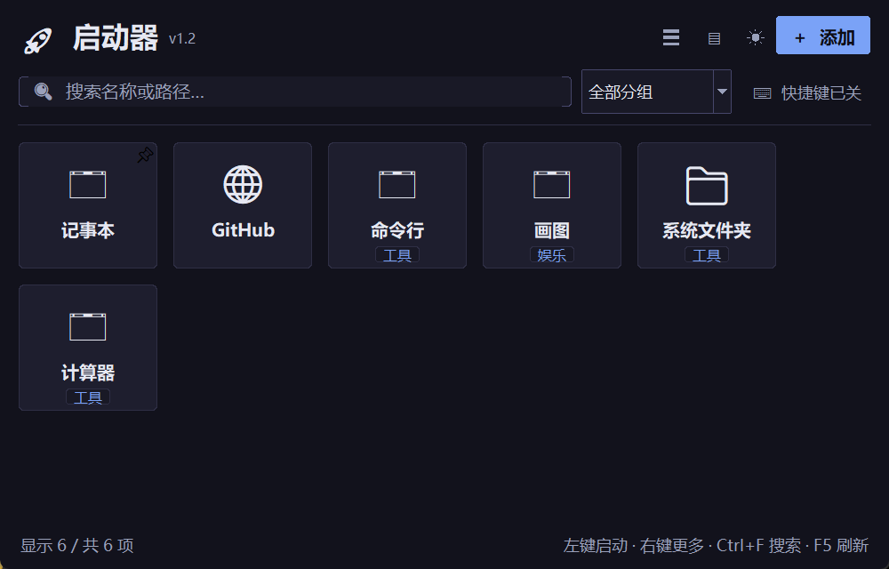
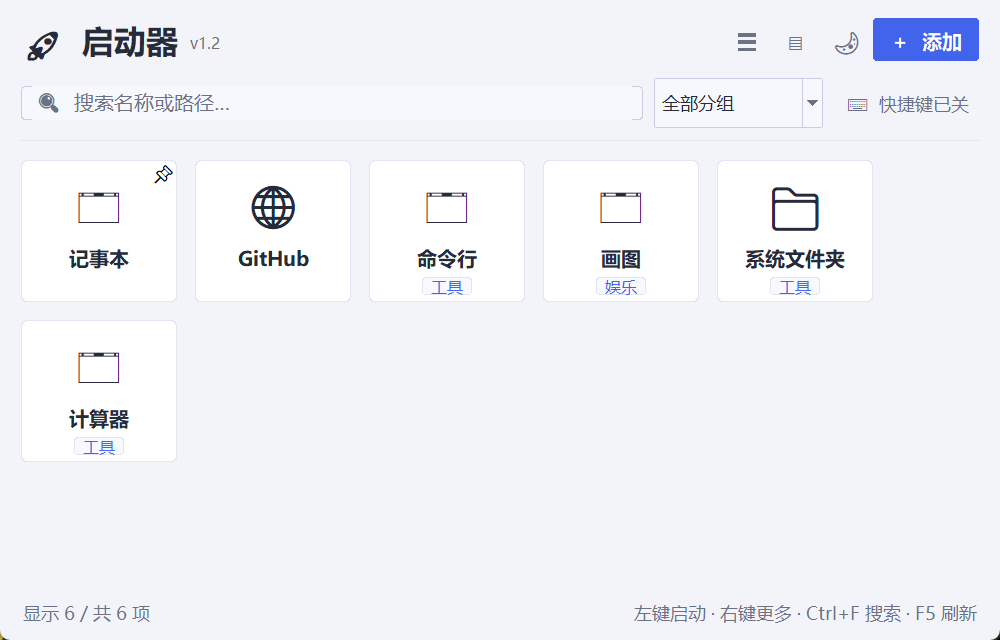
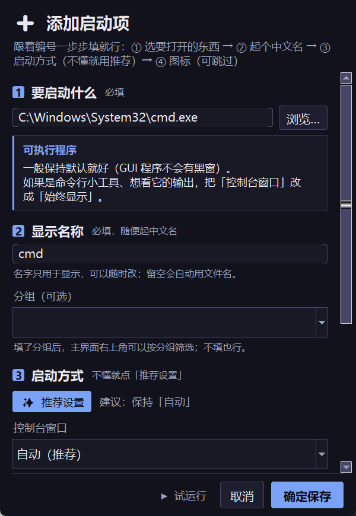
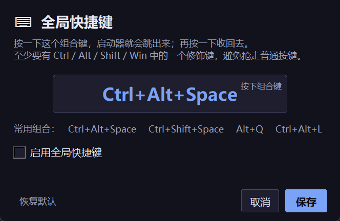
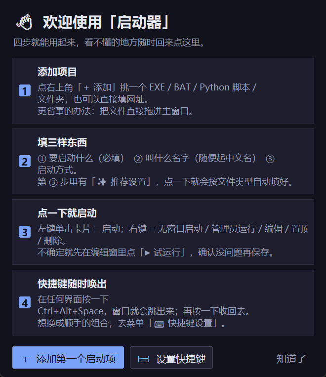
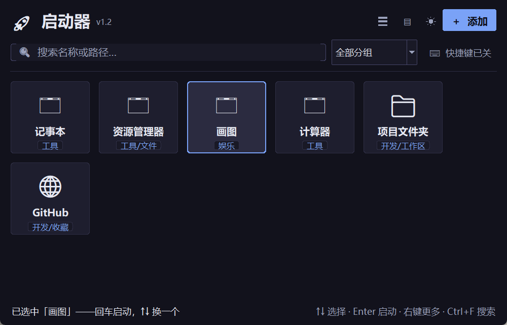

# 🚀 启动器（MyLauncher）

一个 Windows 上的**可视化本地启动器**：把 BAT / EXE / Python 脚本 / 文件夹 / 网址拖进来，
起个中文名、配个图标，点一下就能打开；配好全局快捷键后，**任何界面按一下就能唤出它**。

专门为「路径必须是英文，但自己想看中文名」这种场景做的——纯 Python + Tkinter 单文件，
无第三方界面框架，打包后 35MB 绿色单 exe。

<p align="center">
  
  
</p>

---

## ✨ 功能

**启动与唤出**
- 全局快捷键（默认 `Ctrl+Alt+Space`）随时唤出 / 收起，录制式改键，被占用会明确提示
- 唤出后直接打字搜索，`↑` `↓` 选择、`Enter` 启动——完整的「按一下 → 打两个字 → 回车」流程
- 每个项目可绑**专属快捷键**（如 `Ctrl+Alt+1`），按一下直接启动
- **启动链 / 工作模式**：一键按顺序拉起一组程序（可设间隔），例如「开工模式」
- 右键菜单：无窗口启动 / 管理员运行 / 编辑 / 置顶 / 复制路径 / 删除

**添加与整理**
- 添加窗口有**分步引导**：选目标 → 起名字 → 启动方式 → 图标，每步都写着「必填 / 可跳过」
- 根据文件类型给出针对性提示（bat 为什么要填工作目录、py 要不要黑窗…），一键「✨ 推荐设置」
- 「▶ 试运行」先试再存；路径/工作目录有问题会**原地提示**而不是弹一堆系统小窗
- **从桌面 / 开始菜单批量导入**快捷方式，按所在文件夹自动分好组
- **多层分组**：分组写 `开发/前端` 就是两级，选「开发」会带出所有子分组
- **拖拽排序**、置顶、网格 / 列表视图、按名称 / 常用 / 手动三种排序
- **失效路径体检**：一次列出所有打不开的项目，就地重新指定或批量删除
- 界面空白处右键可**新建文件夹 / BAT / TXT**，建完直接加入启动器（BAT 自带 GBK 模板）

**细节**
- 深色 / 浅色主题，支持**跟随系统**
- 全局图标缓存、自动提取 EXE 原生图标、单实例运行（重复双击只会唤出已有窗口）
- 高 DPI 适配、托盘常驻（托盘菜单直接列出最常用的 6 项）、开机自启
- 配置自动备份（`launcher_config.bak.json`），出错写 `launcher_error.log`

<p align="center">
  
  
  
</p>
<p align="center">
  
  
  
</p>

---

## 🚀 快速开始

### 方式 0：直接下载 exe（最省事，不用装 Python）

到 **[release/启动器.exe](release/启动器.exe)** 点「Download」下载，双击即用。
配置和图标会保存在 exe 同目录下，可以整个文件夹拷到 U 盘 / 别的电脑。

> 33MB 单文件绿色版，Windows 10/11 64 位。首次运行会弹出「使用引导」，看完就会用了。
> 后续版本会放到 [Releases](../../releases) 里，不想每次都下载整个仓库的话走那边更合适。

### 方式 A：直接用源码（要装 Python 3.8+）

```bat
:: 1) 装依赖（首次）
pip install -r requirements.txt

:: 2) 启动
python launcher.py
```

或者直接双击 **`启动.bat`**（自动装依赖 + 用 pythonw 无窗口拉起），
想彻底不看到黑窗口就双击 **`启动-无窗口.vbs`**。

### 方式 B：打包成独立 exe（拷到别的电脑也能用）

双击 **`打包成exe.bat`**，完成后得到 `dist\启动器.exe`，双击即用，不需要装 Python。
配置和图标保存在 exe 同目录下。

> 打包前请先退出正在运行的旧 exe，否则文件被占用会失败。

---

## ⌨️ 快捷键一览

| 场景 | 按键 |
|------|------|
| 唤出 / 收起窗口 | `Ctrl+Alt+Space`（可改） |
| 搜索 | 唤出后直接打字，`Ctrl+F` 定位，`Esc` 清空 |
| 选择 / 启动 | `↑` `↓` 选择，`Enter` 启动，`Home` / `End` 跳首尾 |
| 刷新列表 | `F5` |
| 项目专属键 | 每个项目可单独录制，如 `Ctrl+Alt+1` |

---

## 📖 文档

完整使用说明、常见问题、可改的配置项都在 **[使用说明.md](使用说明.md)**，
程序里也能随时打开：**☰ 菜单 → ❓ 使用引导**。

---

## 🗂 目录结构

```
launcher.py           主程序（全部代码，单文件）
requirements.txt      依赖：pillow / pywin32 / tkinterdnd2 / pystray
启动.bat              一键装依赖并启动（窗口自动关闭）
启动-无窗口.vbs       完全无窗口启动，适合放桌面 / 开机启动
打包成exe.bat         一键打包成独立 exe
使用说明.md           完整文档
release/              打包好的绿色版（启动器.exe + 使用说明副本），下载即用
icons/                程序图标（_app.ico / _app.png / _tray.png）
screenshots/          README 用的界面截图
```

运行后会在程序目录自动生成：`launcher_config.json`（配置，含你的路径，**别提交到仓库**）、
`launcher_config.bak.json`（自动备份）、`launcher_error.log`（出错才有）、`icons/<hash>.png`（图标缓存）。

---

## ⚠️ 几个坑（已处理，留个记录）

- **`启动.bat` / `打包成exe.bat` 是 GBK 编码**（配合 `chcp 936`），在 GitHub 网页上看是乱码是正常的，
  下载下来能正常跑。自己改的话请用 ANSI/GBK 另存，不要存成 UTF-8，否则命令行中文会乱。
- **打包前清掉 `TK_LIBRARY` / `TCL_LIBRARY`**：如果这两个环境变量指向已删除的临时目录，
  PyInstaller 会找不到 Tk 数据目录而打包失败（`打包成exe.bat` 里已经加了 `set "TK_LIBRARY="`）。
- 程序启动时也会主动清掉这两个指向不存在目录的变量，避免 Tk 初始化失败。
- 拖拽添加依赖 `tkinterdnd2`，没装也能用（只是不能拖）。

---

## 📝 更新日志

**v1.2**
- 新增：全局快捷键唤出 / 收起、单项专属快捷键
- 新增：添加向导（分步引导 + 类型化提示 + 推荐设置 + 试运行）、首次使用引导
- 新增：界面重做（圆角卡片 / 按钮 / 输入框，两套配色，聚焦高亮）
- 新增：多层分组、拼音首字母搜索、拖拽排序、桌面/开始菜单批量导入
- 新增：启动链 / 工作模式、失效路径体检、主题跟随系统
- 新增：资源管理器右键「添加到启动器」、界面右键快速新建文件夹 / BAT / TXT
- 改进：重复双击只唤出已开窗口；键盘操作（↑↓ 选择、Enter 启动）

**v1.1**
- 修复命令行窗口乱码、不自动关闭、与启动器控制台绑定的问题
- 新增「工作目录」「启动参数」字段
- 高 DPI 适配、任务栏图标、图标缓存、窗口越界修正、单实例、崩溃日志

---

## 📄 许可证

暂未指定。想开源的话可以加一份 MIT / Apache-2.0，告诉我一声我就补上。
